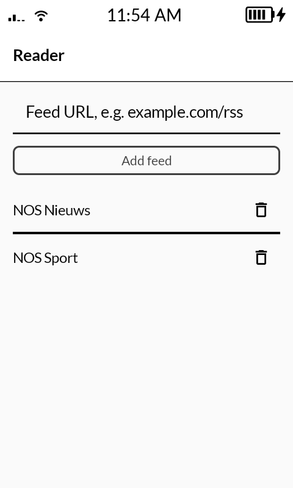
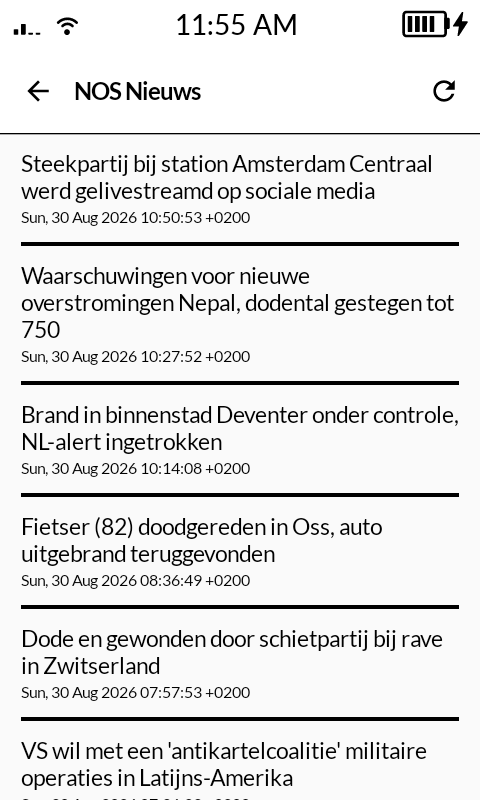
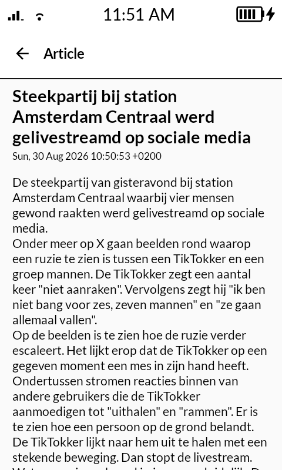

# Reader

Minimal RSS/Atom reader for the Mudita Kompakt (e-ink), built with the Mudita Mindful Design (MMD) framework. Subscribe to feeds by URL and read articles as clean, distraction-free text. No account, no images, no tracking.

Feeds are fetched and parsed with [RSS-Parser](https://github.com/prof18/RSS-Parser); article HTML is flattened to plain text.

<p align="center">
  
  
  
</p>

## Install

```
./gradlew installDebug
```

## How it works

- Add a feed by URL on the main screen; the app fetches it once to read its title.
- Tap a feed to see its articles (unread in bold, read in regular weight), tap an article to read it as text.
- Article HTML is flattened with `HtmlCompat.fromHtml`, so formatting and images are dropped by design.
- Feeds that only publish summaries (not full text) will show just the summary; feeds with `content:encoded` read in full.

## Structure

- `ReaderViewModel.kt`: subscribed feeds (persisted), feed fetching, HTML-to-text
- `ui/FeedsScreen.kt`: add/remove feeds and the feed list
- `ui/ArticlesScreen.kt`: article list for a feed, with refresh
- `ui/ArticleScreen.kt`: the article text

## Notes

- Read/unread is tracked locally by article id (persisted); opening an article marks it read.
- No offline cache yet; feeds are re-fetched when opened.
- Requests use a browser-like User-Agent, since some servers reject the default OkHttp one.
- Pinned to RSS-Parser 6.0.6, the last release built with Kotlin 1.9 (matching MMD's toolchain).

## License

[MIT](LICENSE)
